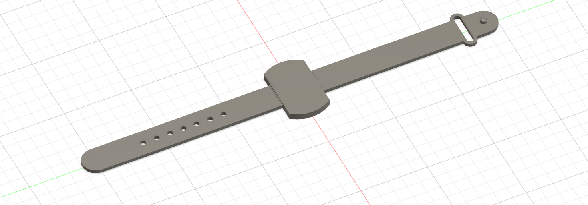

# System Architecture For Wearable Parkinson's Monitor

## Introduction

This document describes the system architecture for the Wearable Parkinson's Monitor

## System Architecture

```
┌────────────────────────────────────────────────────────────────────────────┐  
│                                                                            │  
│     Parkinson's Tremor Wrist Wearable Device Case                          │  
│                                                                            │  
│  ┌───────────────────────────────────────────────────────────────────────┐ │  
│  │   Custom PCB Layout of Device Internals                        ┌──────┴─┴─┐
│  │                                                                │ Buttons  │
│  │   ┌─────────────────────────┐       ┌─────────────────────────┐└──────┬─┬─┘
│  │   │ MCU SOC With Software   │       │  BLE Interface          │┌──────┼─┼─┐
│  │   │                         │       │                         ││ USB  │ │ │
│  │   │ - Rx Accelerometer Data ┼───┬───┤  - Wireless Pairing     │└──────┼─┼─┘
│  │   │ - Sample Window         │   │   │                         │       │ │  
│  │   │ - Low Band Pass Filter  │   │   │                         │       │ │  
│  │   │ - Extract Feature       │   │   │                         │       │ │  
│  │   │ - Characterise Tremor   │   │   │                         │       │ │  
│  │   └─────────────────────────┘   │   └─────────────────────────┘       │ │  
│  │   ┌─────────────────────────┐   │   ┌─────────────────────────┐       │ │  
│  │   │ Accelerometer           │   │   │ Display                 │       │ │  
│  │   │                         │   │   │                         │       │ │  
│  │   │ - Raw Data Stream       │   │   │ - Touch Sensitive       │       │ │  
│  │   │ - SPI/I2C interface     ┼───┼───┼ - Start/Stop            │       │ │  
│  │   │                         │   │   │ - Show Results          │       │ │  
│  │   │                         │   │   │                         │       │ │  
│  │   └─────────────────────────┘   │   └─────────────────────────┘       │ │  
│  │   ┌─────────────────────────┐   │   ┌─────────────────────────┐       │ │  
│  │   │ Secure Flash            │   │   │ Battery (Min 2Hr)       │       │ │  
│  │   │                         │   │   │                         │       │ │  
│  │   │ for Storing Patient     │   │   │ Charging Circuitry      │       │ │  
│  │   │                         ┼───┴───┼                         │       │ │  
│  │   │ Data (2hr Sample)       │       │                         │       │ │  
│  │   │                         │       │                         │       │ │  
│  │   └─────────────────────────┘       └─────────────────────────┘       │ │  
│  └───────────────────────────────────────────────────────────────────────┘ │  
└───────────────────────────────────────────────────────┬──▲─────────────────┘  
                                                        │  │                    
┌───────────────────────────────┐        ┌──────────────▼──┼─────────────────┐  
│  Cloud                        │        │ Android/iPhone App                │  
│                               │        │                                   │  
│  - Web Based Interface        ◄────────┼ - Secure Data                     │  
│  - Secure Phone Connectivity  │        │ - Device Pairing BLE              │  
│  - Secure Data Storage        │        │ - Data Secure Storage/Management  │  
│  - Data Visualisation         ┼────────► - Device Data Autosynchronisation │  
│  - Secure Access              │        │ - Secure Backend Comms            │  
│  - Analytics/Time Series      │        │ - Device Firmware Update-         │  
│  - Firmware Update Service    │        │                                   │  
└───────────────────────────────┘        └───────────────────────────────────┘  
```
Figure: System Architecture Diagram.

The above diagram shows the following:
1. **The Device.** At the top of the diagram, the large box represents the wearable Parkinson's monitior.
    1. The outer box represents the device caseworks.
    1. The inner box represents the device electronics.
1. **The Users Phone.** The botton right box represents the users phone which pairs with the device.
1. **The Cloud.** The bottom left box represents the web based user interface for device management. The device communicates with the cloud via the phone.


### The Device Caseworks

1. The caseworks is a wrist watch type form factor.
1. There is a USB connector through the side of the case. This is used for:
    1. Recharging the internal battery.
    1. Connecting the device to a PC/Manuracturing Station for fast firmware update, configuration and test.
1. There are buttons which project through the side of the case. These are used for operating the device if the touch sensitive display is not fitted.


### The Device Electronics

The device custom PCB has the following components:

1. **Accelerometer.** The accelerometer generates a stream of measured 2D or 3D acceleration datapoints to the MCU.
1. **Microcontroller Unit System-on-Chip (MCU SOC).** The MCU processes the stream of raw datapoints.
1. **Display.** The user interacts with the display to start and stop measurements, and to see results.
1. **Secure Flash.** Sample data sets are stored securely in non-volatile flash.
1. **BLE Wireless interface.** The device connects to the users phone to upload data sets.
1. **Battery.** The rechargable battery powers the system.
1. **USB Connector.** 
1. **Buttons**


#### Accelerometer

As the patient wearing the device experiences tremors, the acceleromter datapoints will measure the oscillatory movement of the wrist.
1. Limb tremors take place in 3D. The accelerometer generates (x, y, z) acceleration datapoints.
1. The datapoints are received by the MCU software over a SPI or I2C bus.

#### Microcontroller Unit System-on-Chip (MCU SOC)

The MCU runs the software which processes the data from the accelerometer, stores samples in the flash, runs the display user interace and communicates with the users phone over the BLE interface.
1. The software receives datapoints from the accelerometer and stores them in memory.
1. Datapoint are stored in a sample buffer or window. From the Nyquist-Shannon Theorem, to measure frequency x Hz, the sampling frequency should be at a minimum 2x Hz.
1. A low pass band filter is applied to the sample to filter out high frequency noise.
1. The characteristic frequency of the tremor is extracted from the sample e.g. by using an FFT library or similar.
1. The FFT or similar analysis is used to determine the type of tremor, discriminiating between the different tremor types. Supported types include:
    1. Parkinson's tremor (todo: give frequency).
    1. Essential tremor (todo: give frequency).
1. The software runs a BLE stack which manages the BLE wireless physical interface.


#### Display


#### Secure Flash
#### BLE Wireless interface
#### Battery
#### USB Connector
#### Buttons


1. 
    1. 
    1. 
1. 


### The Users Phone

### The Cloud

This document describes the caseworks system architecture.

```

                                                      ┌─────────────────────────────────┐
┌──────────────┐                                      │      Watch Type Form Factor     │
│              │                                      │                                 │
│    PC        │                                      │              Case               │
│              │                                      │  ┌─────────────────────────────┐│
│  Running     │                                      │  │                             ││
│              │                                      │  │   Accelerometer             ││
│  Terminal    │                                      │  │                             ││
│              │             USB Cable                ├──┴──┐                          ││
│  Console     ┼──────────────────────────────────────┼ USB │                          ││
│              │                                      ├──┬──┘                          ││
└──────────────┘                                      │  │                             ││
                                                      │  └─────────────────────────────┘│
                                                      └─────────────────────────────────┘
                                                                                                      
``` 
Figure: Autodesk 3D Fusion isometric mock-up of intended device form factor.

The following picture shows the intended form factor of the wearable device.

                                                                                                      
 Figure: Autodesk 3D Fusion isometric mock-up of intended device form factor.
                                                                                                      